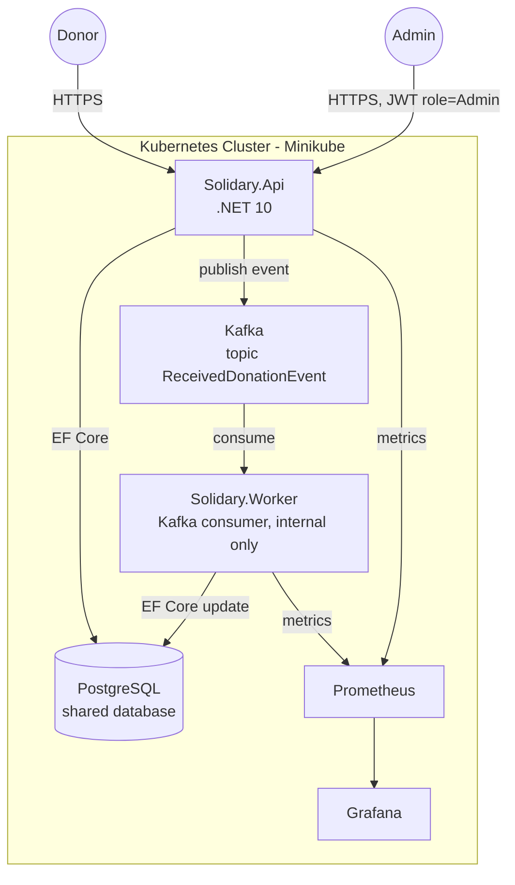
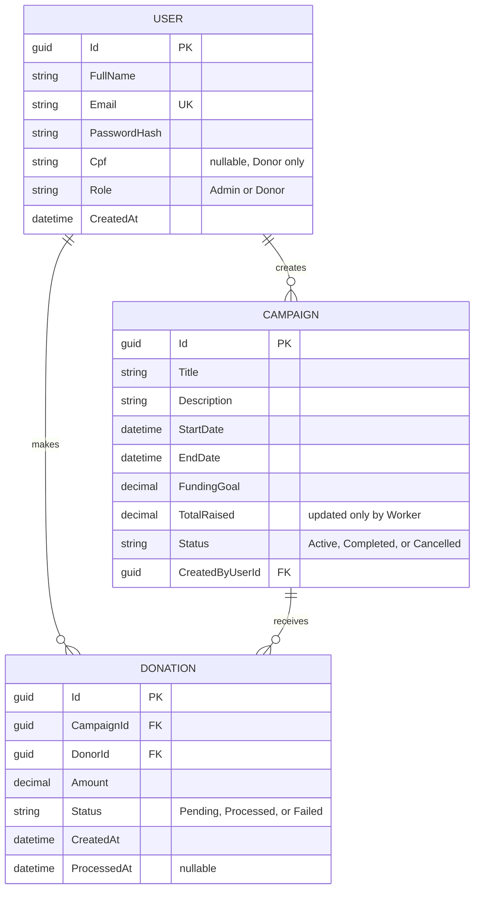
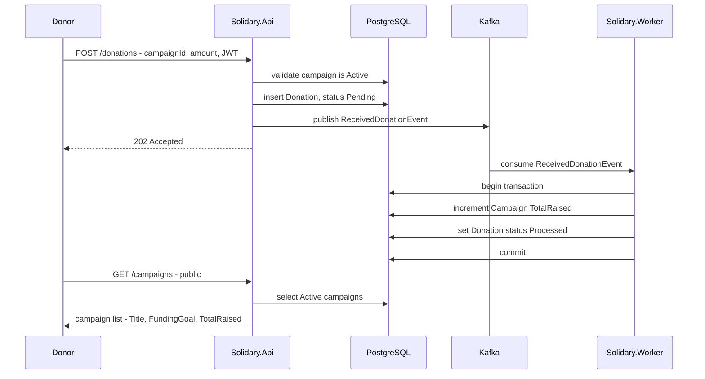
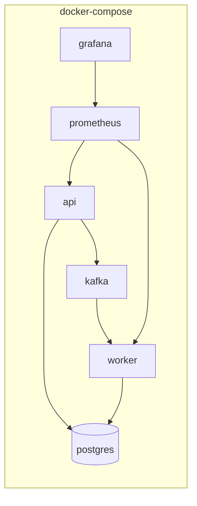
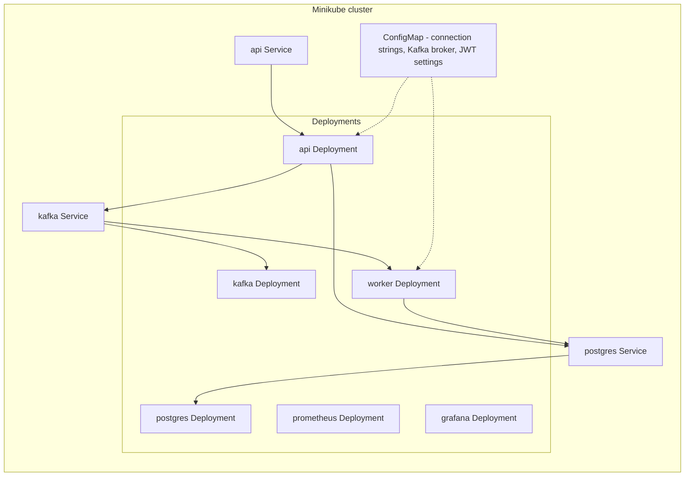

# Conexão Solidária — Architecture

MVP donation platform for the NGO "Esperança Solidária". Two microservices (`Api`, `Worker`) communicating asynchronously via Kafka, backed by a shared PostgreSQL database, observed with Prometheus + Grafana.

## 1. Container Diagram

**Notes**
- `Worker` has no external Service/Ingress exposure — it only talks to Kafka and Postgres.
- Both services expose `/health` (liveness/readiness) and `/metrics` (Prometheus scrape target).
- Single shared Postgres database for the MVP: simpler to run/demo in a hackathon timeframe than database-per-service; the tradeoff is documented in the DB justification doc since `Worker` writes into the same schema `Api` owns migrations for.

## 2. Entity-Relationship Diagram

## 3. Sequence Diagram — Donation Flow

This matches the demo video script: show the donation payload being sent, open the Kafka UI to show the message on the topic, then call the public campaigns endpoint to prove the Worker updated the total.

## 4. Deployment Views

### Local development (docker-compose)

### Minikube

`Worker` has a Deployment but no externally-reachable Service (ClusterIP only for Prometheus scraping), consistent with "not exposed externally" in the requirements. `api Service` is a NodePort so it's reachable from outside the cluster for the demo; every other Service above is ClusterIP-only.

## 5. Naming Reference (Portuguese spec → English domain model)

| Spec term (pt-BR) | Domain model (en) |
|---|---|
| Usuário | `User` |
| GestorONG | `UserRole.Admin` |
| Doador | `UserRole.Donor` |
| Campanha | `Campaign` |
| Meta Financeira | `Campaign.FundingGoal` |
| Valor Total Arrecadado | `Campaign.TotalRaised` |
| Doação | `Donation` |
| DoacaoRecebidaEvent | `ReceivedDonationEvent` |
